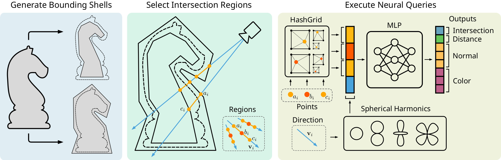

# Double Bounded Neural Ray Queries

Source code of the paper "Double Bounded Neural Ray Queries" by Alexander Nikolaev, Nikolay Mozokhin, Roman Rodionov and Vladimir Frolov



## Installation

**Get code with all dependencies**
```bash
git clone --recurse-submodules https://github.com/Alehandreus/double-bounded-rt
```

Our work consists of two main parts: model trainer and neural renderer. First is based on python with torch, mesh-utils (custom bvh traversal lib) and tiny-cuda-nn. Second is programmed on C++ with CUDA and OptiX acceleration. **Ensure you have proper CUDA installation.**

### Trainer setup

**Create python venv and launch it**

```bash
python3 -m venv venv
source venv/bin/activate
```

**Install PyTorch with CUDA support (non CUDA versions are not supported)**

```bash
# if your default pip version is quite old (torch may require newer for installation)
python -m pip install --upgrade pip      
# replace "cu128" with your CUDA version
pip install torch --index-url https://download.pytorch.org/whl/cu128      
```

**Install other python packages**

```bash
pip install numpy tqdm pillow tensorboard
```

**Setup [mesh-utils](https://github.com/Alehandreus/mesh-utils).**
**Firstly, install assimp, glm, openmp (go to [mesh-utils readme](https://github.com/Alehandreus/mesh-utils/tree/main#mesh-utils) for more details). After that replace 120 line in `trainer/mesh-utils/CMakeLists.txt` with [your Compute Capability](https://developer.nvidia.com/cuda-gpus) and run**

```bash
cd trainer/mesh-utils
pip install .
cd -
```

**Setup [tiny-cuda-nn](https://github.com/julcst/tiny-cuda-nn) PyTorch extension (we use fork with _3x3 and 3x3 fix). You may need install build-essential for Linux. Please refer to [their docs](https://github.com/julcst/tiny-cuda-nn/#pytorch-extension) for more details**
```bash
cd renderer/ext/tiny-cuda-nn/bindings/torch
python setup.py install
cd -
```

### Renderer building

Almost all necessary libs are downloaded via `--recurse-submodules` key. You need to **install [OptiX](https://developer.nvidia.com/designworks/optix/download) manually and add OptiX path to `renderer/CMakeLists.txt` 130 line.**

**Build renderer without OptiX support**

```bash
cd renderer
cmake -B build
cmake --build build --target viewer evaluate compare_images
```

**Build renderer with OptiX hardware ray tracing**

```bash
cd renderer
# replace "compute_89" with your Compute Capability
cmake -B build -DUSE_OPTIX=ON -DOPTIX_PTX_ARCH=compute_89
cmake --build build --target viewer evaluate compare_images
```

## Scene rendering

We provide several scenes with prepared bounding shells. In this repo only chess scene are presented, for other ones please go to disk.

Every sсene has it own config file with all required information. They are located in `scenes/<scene_name>/configs`. They contains paths to inner and outer shells, neural and non-neural part of scene, model weights and background HDR images.

**Launch renderer for chess scene (ensure you are in `renderer` folder)**

```bash
./build/viewer ../scenes/chess/configs/chess_out20k_in10k_hg16.json
```

**Render ground-truth chess scene vs neural chess scene (outputs will be saved to `comparison_output/`)**
```bash
./build/evaluate ../scenes/chess/configs/chess_out20k_in10k_hg16.json
```

**Compare two images (PSNR + FLIP)**
```bash
./build/compare_images <reference.png> <test.png> [flip_output.png]
```

## Model training

`trainer/config.py` contains all parameters for training like hash-grid and MLP config (in tiny-cuda-nn format), learning rates, paths to meshes.

**To start training simply run (ensure you are in `trainer` folder)**

```bash
python train.py
```

By default on every evaluation simple lambert visualization is launched. You can use full renderer evaluation instead, but it is more memory consuming. Change `cfg.visualization.use_neural_renderer` to `True` and specify `cfg.json_config_path` with relevant scene config path.

Also you can use tensorboard viewer. All metrics logs are stored in `runs` folder.

**Launch TensorBoard**
```
tensorboard --logdir runs
```

## Creating own compatible scenes

Our pipeline support separate neural and non-neural rendering. You may need 3 different `.glb` files: whole scene, neural part of the scene and non-neural. Check scene config examples and trainer config for more details.

Also you need inner and outer bounding meshes of desired part for neural compression. You can create them with our fork of [bouning-mesh](https://github.com/Alehandreus/bounding-mesh) (it has inward mode fix). We suggest using `-m MinConstant` flag and fixing geometry of mesh (like removing duplicate vertices and recalculating normals in Blender). But sometimes it produces unproper result still, so manual correction may be required.